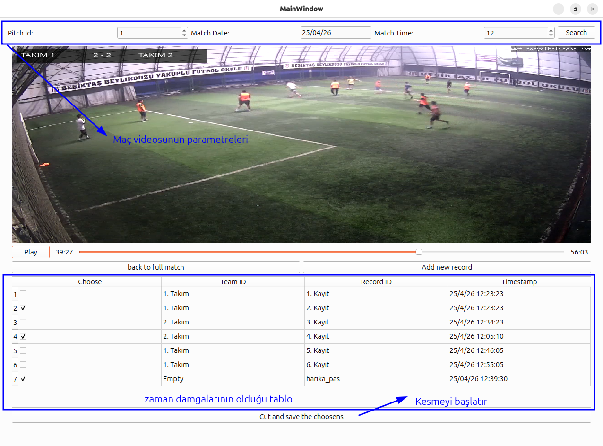
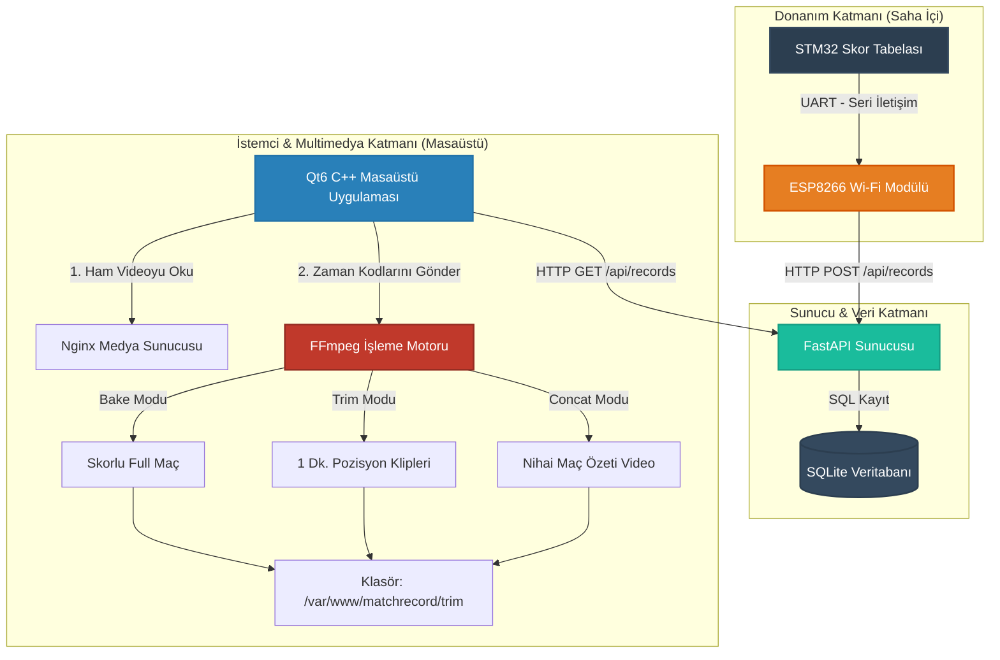
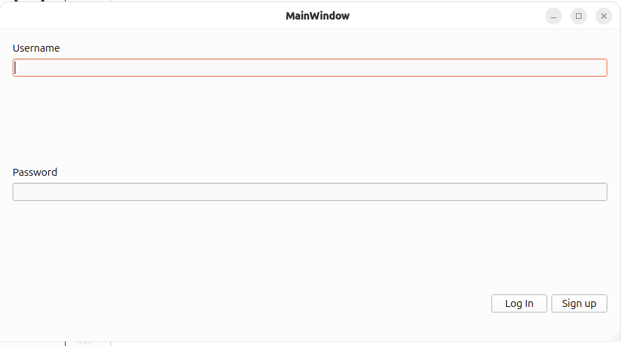
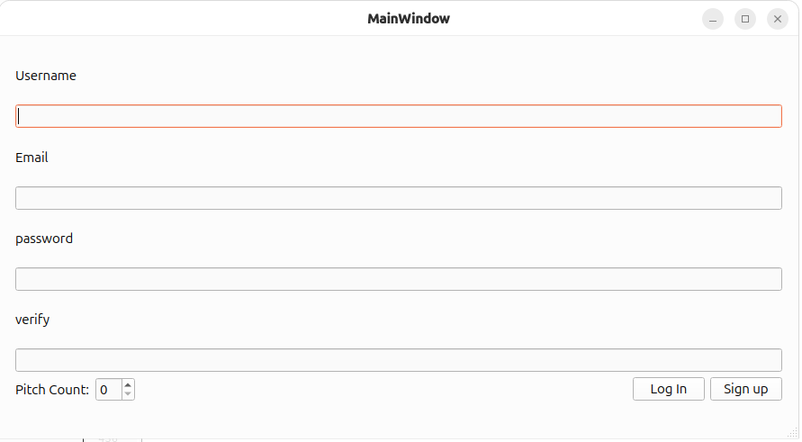
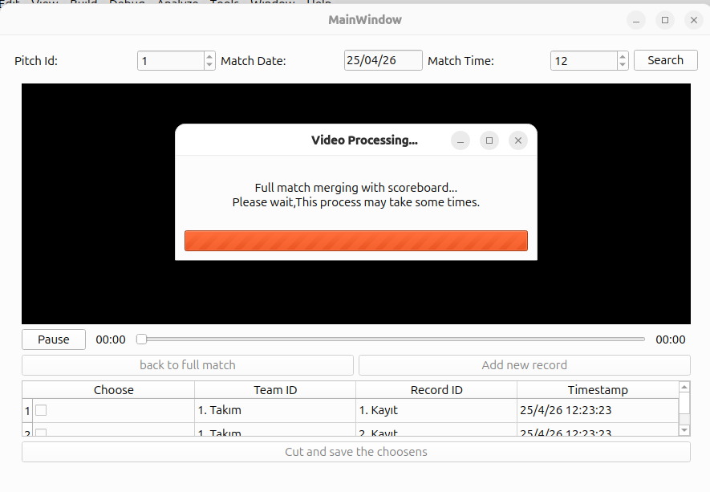

# ⚽ QWidget Maç Özetleri & Dinamik Skor Tabelası Üreticisi

Yerel veya uzak halı saha maç videolarını işlemek, video üzerine kronolojik ve dinamik skor tabelası (scoreboard) basmak, pozisyon kesitleri almak ve bu kesitleri otomatik olarak tek bir maç özeti (kolaj) videosu halinde birleştirmek için tasarlanmış asenkron bir gömülü-masaüstü yazılımıdır.



---

## 🚀 Öne Çıkan Özellikler

* **Güvenli Kimlik Doğrulama Sistemi:** FastAPI backend mimarisiyle entegre, OAuth2 token tabanlı çalışan ve şifre maskeleme (`QLineEdit::PasswordEchoOnEdit`) özelliğine sahip Modüler Giriş (Login) ve Kayıt Ol (SignUp) arayüzleri.
* **Donanım Hızlandırmalı Video Tuvali:** Sanal makinelerde veya Linux/Ubuntu ortamlarında sıkça yaşanan donanımsal katman sızmalarını ve hayalet görüntü kırpışmalarını engellemek için `QGraphicsView` ve `QGraphicsVideoItem` mimarisiyle geliştirilmiş kararlı video alanı.
* **Dinamik Skor Basma Motoru:** Zaman tabanlı koşullu filtreleme (`enable='between(t,x,y)'` ve `gt(t,x)`) kullanarak, tablodaki gol verilerine göre skoru video piksellerine kalıcı olarak işleyen gelişmiş FFmpeg Filtergraph yapısı.
* **Asenkron Kesme Kuyruğu:** Kullanıcı arayüzünün (UI) kilitlenmesini önleyen ve arka arkaya seçilen 1 dakikalık pozisyon kliplerini sırayla kesen, durum korumalı (`FFmpegMode`) `QProcess` çoklu iş parçacığı yönetimi.
* **Tek Tıkla Anında Maç Özeti:** Kesilen tüm klipleri, kalite kaybı yaşamadan ve yeniden render (encode) gerektirmeden saliseler içinde uç uca ekleyen yüksek hızlı FFmpeg Concat Demuxer kalıbı.
* **Entegre Altyapı Otomasyonu:** Hedef bilgisayarlarda Nginx sunucusu ile entegre çalışmaya hazır, standart Unix dizinlerini (`/var/www/matchrecord`) video akış bileşenlerine bağlayan yapı.

---

## 🏗️ Sistem Mimarisi

Uygulama, masaüstü arayüzünün akıcılığını korurken veri giriş-çıkış (IO) performansını dengelemek için yerel akış yığınıyla asenkron olarak haberleşir:


---

## 📸 Ekran Görüntüleri & Görsel Tur

> Arayüz elemanlarınızın çalışma akışını burada sergileyebilirsiniz. Yakaladığınız ekran görüntülerini projenizin kök dizininde `screenshots/` adlı bir klasör oluşturarak içine ekleyebilirsiniz.

### 🔐 1. Güvenli Erişim (Giriş & Kayıt Panelleri)
| Giriş Ekranı | Kullanıcı Kaydı |
|---|---|
|  |  |

### 📺 2. Video Analiz & Kesim İstasyonu
Ana panel, zaman damgalarını video konumuyla senkronize eder. Video alanının esnek yapısı ve sol üstteki dinamik skor tabelası (`3 - 2`) tam uyumla çalışır.


### ⏳ 3. Bloklamayan İşlem Penceresi (Modal Pop-up)
Arka planda uzun H.264 maç videoları işlenirken, kullanıcının arayüze dokunmasını engelleyen ancak asenkron akışı bozmayan özel kilitli yükleniyor penceresi.


---

## 🛠️ Kurulum ve Bağımlılıklar

### Gereksinimler
* **Qt 6.x** (Widgets, Multimedia ve Network modülleri)
* **FFmpeg 6.x veya üzeri** (Sistem ortam değişkenlerine/PATH'e eklenmiş olmalıdır)
* **Nginx** (Port `8085` üzerinde `/var/www/matchrecord` dizinini sunacak şekilde yapılandırılmış)

### Linux (Ubuntu/Debian) İçin Hızlı Kurulum
```bash
# 1. Medya bağımlılıklarını kurun
sudo apt update && sudo apt install ffmpeg nginx -y

# 2. Depoyu klonlayın
git clone [https://github.com/EmreBilal98/QWidget_Match_Highlights.git](https://github.com/EmreBilal98/QWidget_Match_Highlights.git)
cd QWidget_Match_Highlights

# 3. Nginx motoru için gerekli yerel dizinleri hazırlayın
sudo mkdir -p /var/www/matchrecord/matches
sudo chown -R www-data:www-data /var/www/matchrecord
sudo chmod -R 755 /var/www/matchrecord
